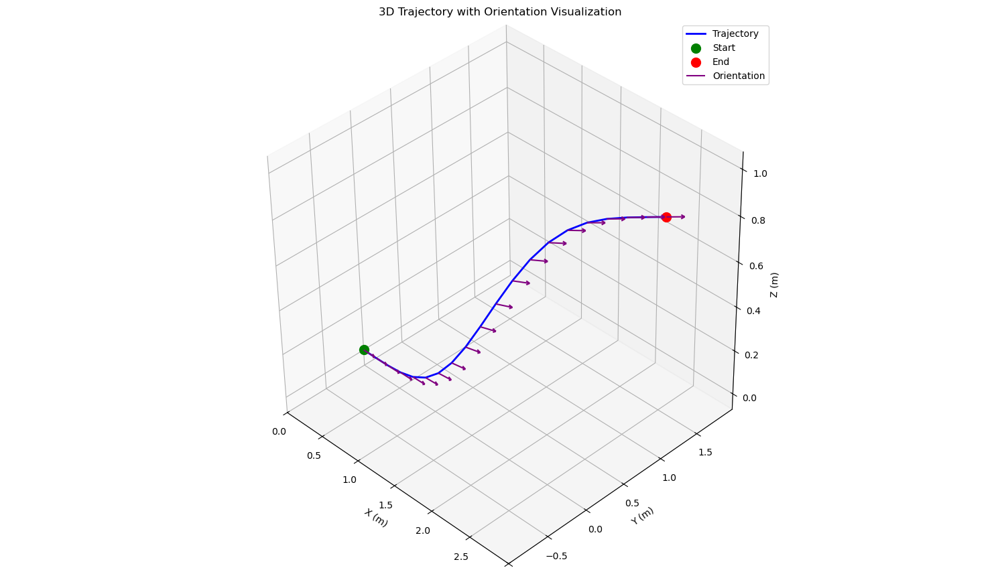

# py_mav_trajectory_generation

This repository contains the Python bindings for the standalone [`mav_trajectory_generation`](https://github.com/ethz-asl/mav_trajectory_generation) repository code. The Python bindings are generated using `pybind11` and can be used to generate trajectories for rotary-wing micro aerial vehicles (MAVs).

<p align="center">
  
</p>

## Installation Instructions (tested on macOS Sequoia)

Follow the steps below to install the Python bindings for the `mav_trajectory_generation` repository:

1. **Clone this Repository**
  
    ```bash
    git clone git@github.com:FabioArnez/mav_trajectory_generation.git
    ```

2. **Move inside the ``mav_trajectory_generation_sa`` folder**

    ```bash
    cd mav_trajectory_generation_sa
    ```

3. **Create a Conda Environment and Install the Requirements**:

    ```bash
    conda create -n <env_name> python=3.10
    ```

    Install the requirements described in the `README.md` file from the `mav_trajectory_generation_sa` folder:

    ```bash
    conda install -c conda-forge cxx-compiler
    conda install conda-forge::pybullet

    conda install conda-forge::cmake
    conda install conda-forge::pkgconfig
    conda install conda-forge::glog
    conda install anaconda::gflags
    conda install conda-forge::eigen
    conda install -c conda-forge boost-cpp
    conda install -c conda-forge yaml-cpp
    conda install -c conda-forge gtest==1.16.0
    conda install -c conda-forge nlopt==2.8.0

    conda install -c conda-forge pybind11
    ```

4. **Compile the standalone version and its Python bindings**:

    Crete the `build` folder and move inside it:

    ```bash
    mkdir build
    cd build
    ```

    Compile the standalone version, and compile and install its Python bindings:

    ```bash
    cmake -DCONDA_PREFIX=$CONDA_PREFIX -DCMAKE_INSTALL_PREFIX=$CONDA_PREFIX ..

    make -j4
    ```

5. **Test the Python bindings**:

    If the compilation of the standalone version, and the compilation and installation of its Python bindings were successful, you can test the Python bindings by running the following command:

    ```bash
    mv ../test/
    python3 test_trajectory_planner.py
    ```

   you should generate the same trajectorty as the one in the plot at the beginning of this README file.

For more information on the steps to compile fromthe standalone version from scratch, se the `README.md` file inside the `mav_trajectory_generation_sa` folder.

For more technical details about the [`mav_trajectory_generation`](https://github.com/ethz-asl/mav_trajectory_generation) library, see the `README_mav_trajectory_generation.md` file.

## Use in Python

To use the python bindings, you can import the module in python as follows:

```python
from trajectory_planner import TrajectoryPlanner4DOF 
from trajectory_planner import Trajectory
from trajectory_planner import derivative_order
```

## Original mav_trajectory_generation Code

The [`mav_trajectory_generation`](https://github.com/ethz-asl/mav_trajectory_generation) repository contains tools for polynomial trajectory generation and optimization based on methods described in [1].
These techniques are especially suitable for rotary-wing micro aerial vehicles (MAVs).
This README provides a brief overview of our trajectory generation utilities with some examples.

**Authors**: Markus Achtelik, Michael Burri, Helen Oleynikova, Rik Bähnemann, Marija Popović  
**Maintainer**: Rik Bähnemann, brik@ethz.ch  
**Affiliation**: Autonomous Systems Lab, ETH Zurich  


## Bibliography
This implementation is largely based on the work of C. Richter *et al*, who should be cited if this is used in a scientific publication (or the preceding conference papers):  
[1] C. Richter, A. Bry, and N. Roy, “**Polynomial trajectory planning for aggressive quadrotor flight in dense indoor environments,**” in *International Journal of Robotics Research*, Springer, 2016.
```
@incollection{richter2016polynomial,
  title={Polynomial trajectory planning for aggressive quadrotor flight in dense indoor environments},
  author={Richter, Charles and Bry, Adam and Roy, Nicholas},
  booktitle={Robotics Research},
  pages={649--666},
  year={2016},
  publisher={Springer}
}
```

Furthermore, the nonlinear optimization features our own extensions, described in:  

Michael Burri, Helen Oleynikova, Markus Achtelik, and Roland Siegwart, “**Real-Time Visual-Inertial Mapping, Re-localization and Planning Onboard MAVs in Previously Unknown Environments**”. In *IEEE Int. Conf. on Intelligent Robots and Systems* (IROS), September 2015.
```
@inproceedings{burri2015real-time,
  author={Burri, Michael and Oleynikova, Helen and  and Achtelik, Markus W. and Siegwart, Roland},
  booktitle={Intelligent Robots and Systems (IROS 2015), 2015 IEEE/RSJ International Conference on},
  title={Real-Time Visual-Inertial Mapping, Re-localization and Planning Onboard MAVs in Unknown Environments},
  year={2015},
  month={Sept}
}
```
